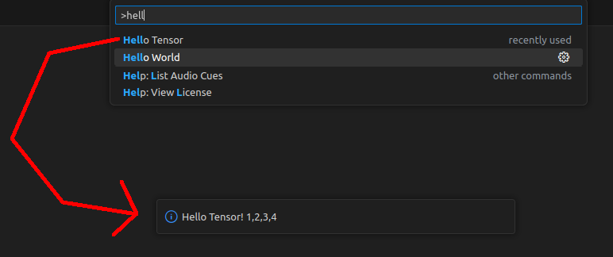

# Transformers.js VSCode example

This is a simple example that shows you how to use the VS Code API alongside Transformers.js.

## Demo

## VS Code API

### `vscode` module

- [`commands.registerCommand`](https://code.visualstudio.com/api/references/vscode-api#commands.registerCommand)
- [`window.showInformationMessage`](https://code.visualstudio.com/api/references/vscode-api#window.showInformationMessage)

### Contribution Points

- [`contributes.commands`](https://code.visualstudio.com/api/references/contribution-points#contributes.commands)

## Running the Sample

- Run `npm install` in terminal to install dependencies
- Run the `Run Extension` target in the Debug View. This will:
	- Start a task `npm: watch` to compile the code (which we don't need)
	- Run the extension in a new VS Code window

Shortcut: Just press F5.

If something doesn't work, remember to just add some `debugger` statements!
